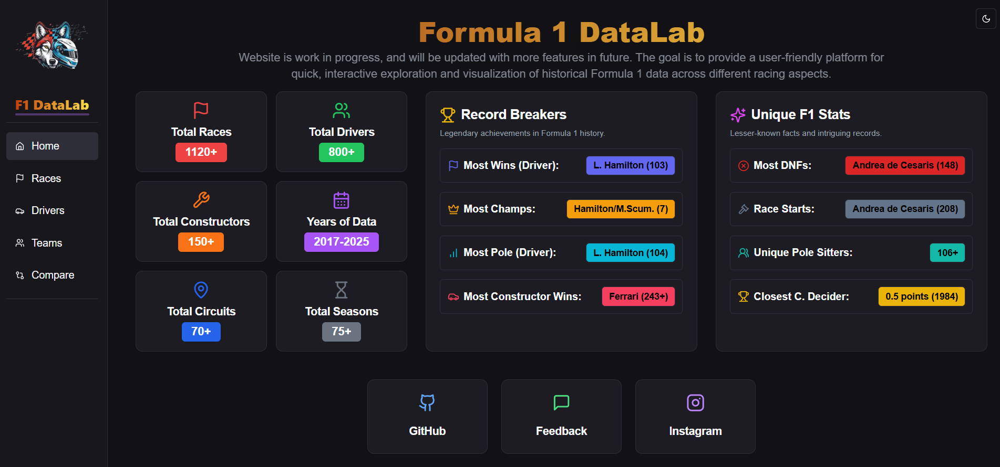
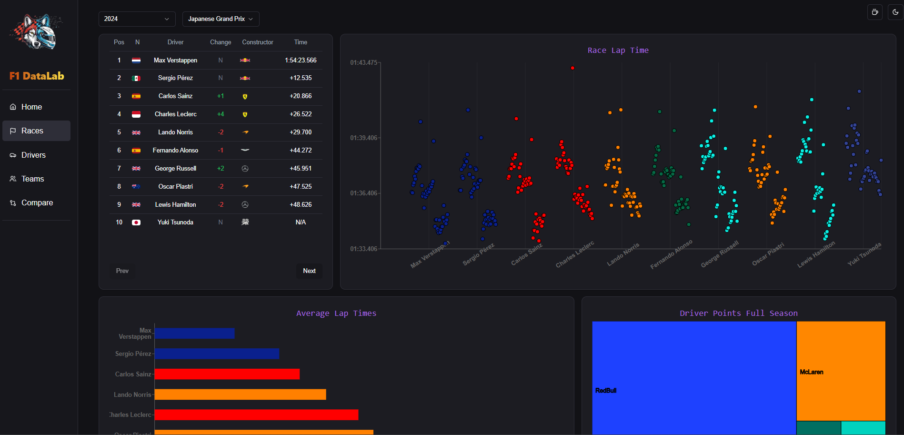

# F1DataLab - A Formula 1 Data Visualization Site

> ⚠️ **Sunset Notice:** This project is being sunsetted. The successor is **[formula-telemetry.com](https://formula-telemetry.com)**, which offers enhanced features and live telemetry data.

## Screenshots

*F1DataLab Dashboard - Overview of key statistics and race records*

*Race Analytics - Detailed lap times and driver performance visualization*

F1DataLab is a full-stack web application built to showcase modern development practices and provides a platform to explore and visualize historical racing data.

## Key Features

The application provides an interactive experience for exploring Formula 1 data through a variety of charts and tables:

*   **Race Results:** Explore data from individual races, including finishing positions, and other key race events visualized in clear, informative charts.
*   **Driver Analytics:** Analyze driver performance, career milestones, and year-over-year results with intuitive graphs.
*   **Constructor Insights:** View detailed statistics and performance data for F1 constructors across different seasons.

## Technology Stack

*   **Frontend:** Next.js 14 with TypeScript, Tailwind CSS, and Recharts for data visualization
*   **Backend:** Fastapi REST API with SQLAlchemy ORM
*   **Database:** MySQL for structured F1 racing data

## License

This project is licensed under the MIT License. See the [LICENSE](LICENSE) file for details.